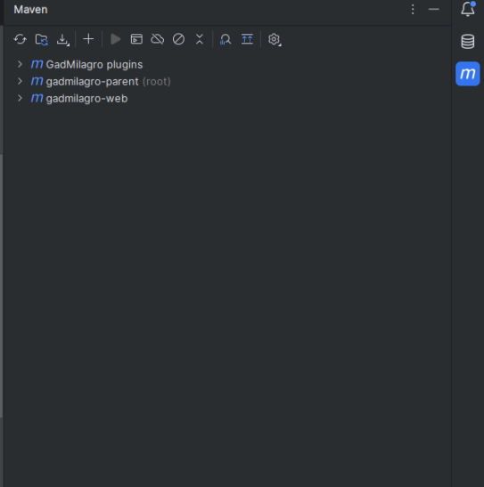
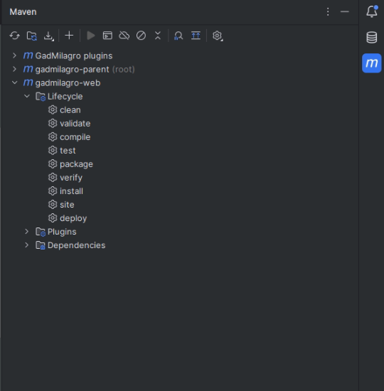
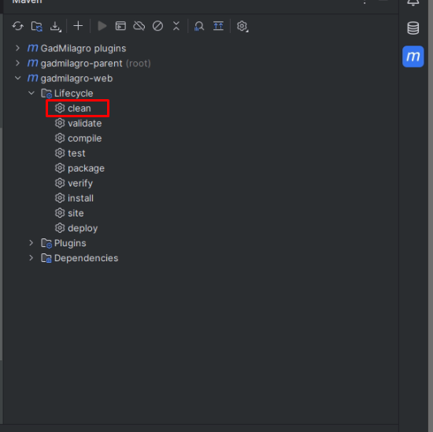
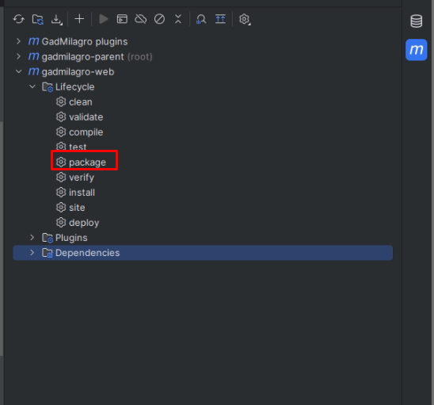
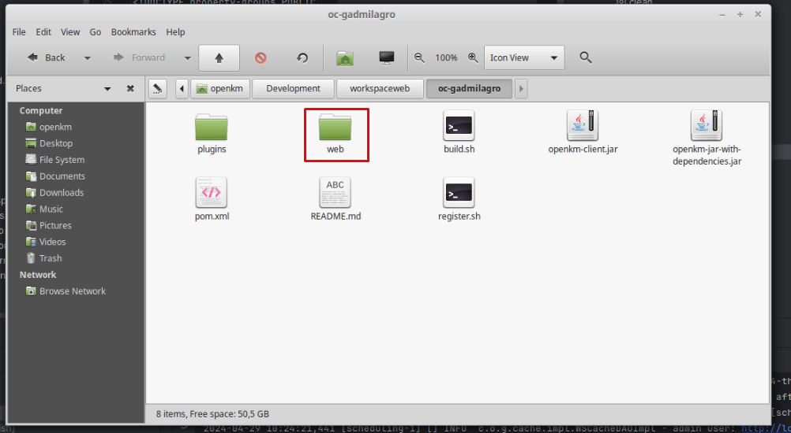
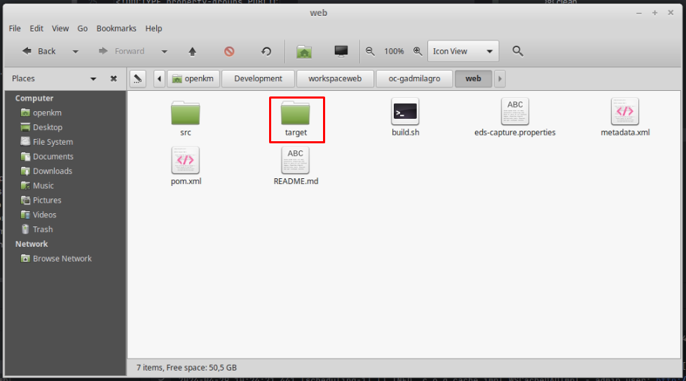
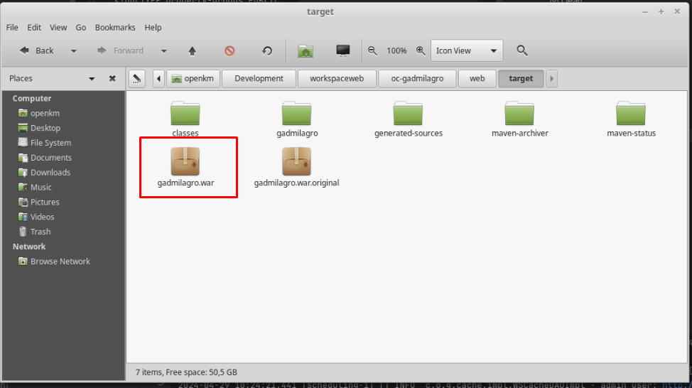
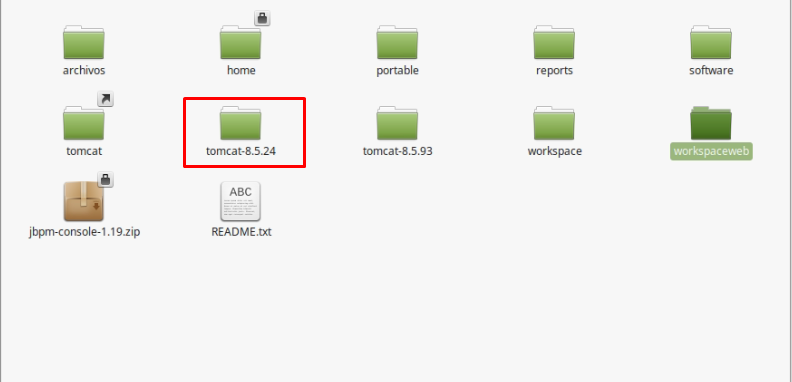
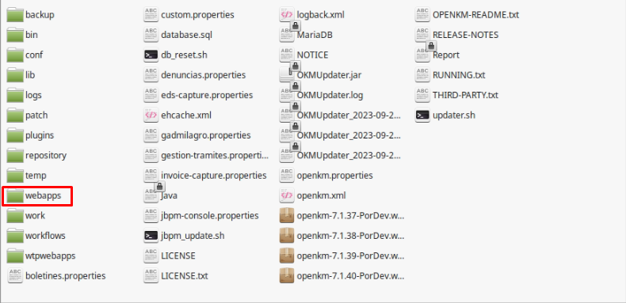

# Descripción
GAD MILAGRO BIBLIOTECA DESPLIEGUE.

## Pasos para la configuración
### Paso 1 - configuración del gadmilagro.properties, este archivo se debe crear en la carpeta raiz del servidor tomcat donde esta ubicado openkm:
**Note**: `admin.user` need to have the OKM_ADMIN role.

  ```
  # OpenKM
openkm.url=http://localhost:8081/openkm
openkm.url.preview=http://localhost:8081/openkm

# OpenKM admin user
admin.user=okmAdmin
admin.password=admin

# Preview
preview.download.url=http://localhost:8081/gadmilagro/download
```


### Paso 2 - Crear Metadata
En el apartado de administración de Openkm, se da clic sobre metadta y se agrega  el nuevo grupo de metadata que esta a continuación:
<?xml version="1.0" encoding="UTF-8"?>
<!DOCTYPE property-groups PUBLIC "-//OpenKM//DTD Property Groups 3.10//EN"
                                 "http://www.openkm.com/dtd/property-groups-3.10.dtd">
<property-groups>

	<property-group label="Gad Milagro" name="okg:gad_milagro">		
		<input label="Autor" name="okp:gad_milagro.author" > </input>
		<input label="Título" name="okp:gad_milagro.title"> </input>
		<input label="Edición" name="okp:gad_milagro.edit"> </input>
		<input label="Año" name="okp:gad_milagro.year" > </input>

     </property-group>

</property-groups>

### Paso 3 - Generar archivo .war

Ubicarse dentro del proyecto en intellij, y en la parte derecha en la barra lateral vertical nos vamos al apartado de maven



Después entramos en el proyecto web de gadmilagro, y seleccionamos lifecycle. Dentro de esta carpeta damos clic primero en clean luego en validate y luego en package si las dos anteriores no dieron ningun error.







Una vez que se haya hecho esto ir al directorio en donde se encuentra el proyecto y entrar dentro de la carpeta de gadmilagro web, y comprobar que se creo la carpeta target ya que esta carpeta es donde se crea
el .war de nuestra aplicación.







Una vez que se compruebe que existe el archivo .war, se debe copiar y pegar este archivo en la carpeta webapps del servidor tomcat donde este corriendo el openkm.






dentro de esa carpeta se pega el .war de la aplicación, y despues se ejecuta el servidor.


